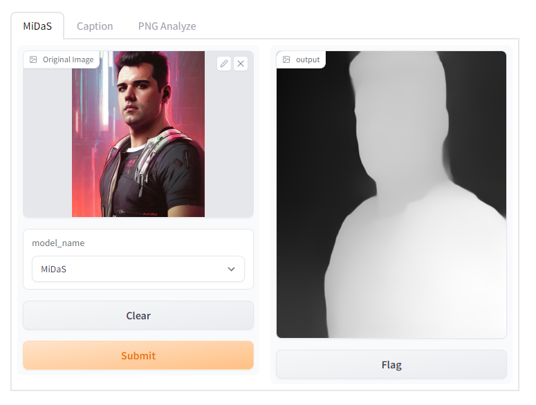
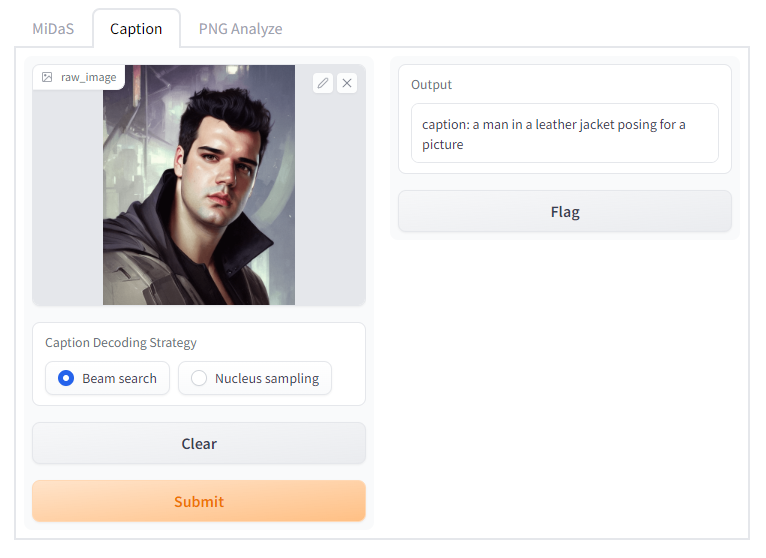
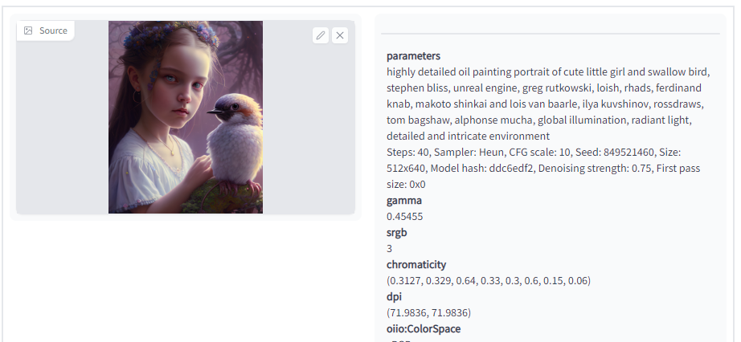
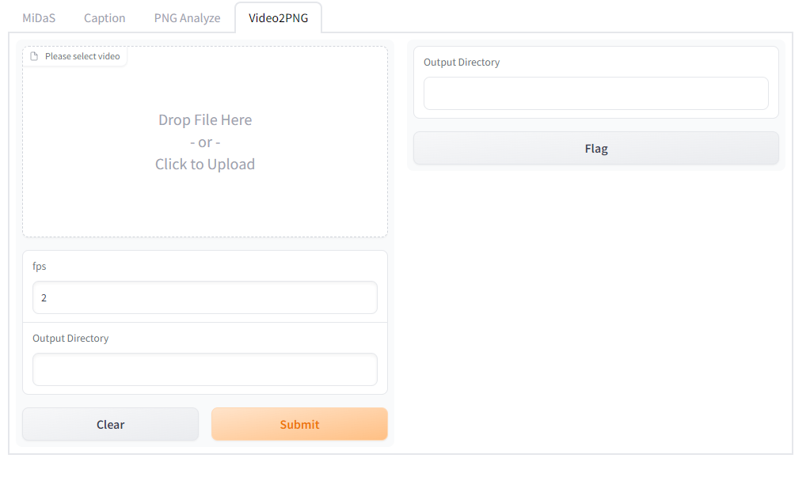

# Smart Image Tool
> "This repo is still under development, so you are likely to experience long loading times or errors."

## Features

### Depth Map

Use MIDAS to easily generate depth maps for your images and unlock hidden depths in your data.

### Image Captioning

Generate captions for your images with this repo's image captioning implementation.

### PNG Analyze

Generate captions for your images with this repo's image captioning implementation.

###  Video to PNG Sequence

This extension uses ffmpeg and Python to convert a video file into a sequence of PNG images.

## Features

- MiDaS Depthmap
- Image Captioning
  - LAVIS
  - BLIP
  - OFA
- PNG Chunk Analyzer

## To-Do

- Load models only using
